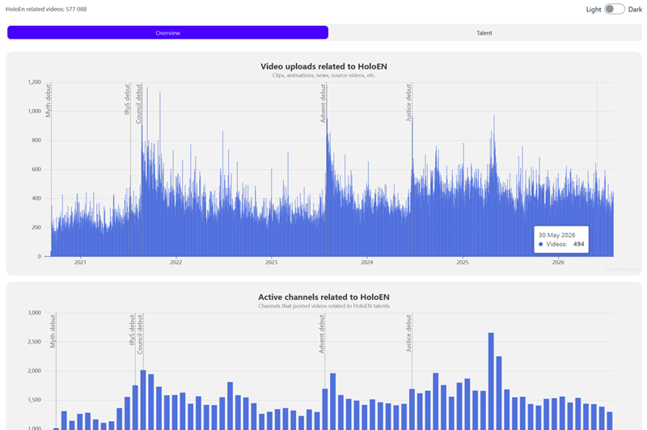

# Derivative Content Tracker for YouTube

A project for finding and classifying VTuber-related videos, and visualizing the data. 
Finds source videos as well as derivative videos (fan-made clips, edits, translations, and other videos related to specified VTubers) 

Built with Python, PostgreSQL, and Docker, using the YouTube Data API v3 to source the data.
## [View Live](https://holoclipstats.com)

---

## Architecture
The project consists of two main parts: data collector and data visualizer

### Data collector
Continuous Python script updates data via the YouTube API:
1. Query the database to plan the next request to YouTube API
2. Make the request. (Handle errors, validate data, structure data)
3. Save the data atomically
4. Repeat using internal schedule

### Data visualizer
The dashboard provides both community-wide and VTuber-specific views of derivative content. 
It shows insights such as the number of uploads from both source and derivative channels, active derivative channels each month, cumulative uploads, uploads share of different VTuber groups, channels contributing the most derivative videos to individual VTubers, etc.
The FastAPI backend handles user-facing requests:
1. User opens a page or interacts with the UI 
2. This calls a corresponding API endpoint
3. The endpoint queries the database, prepares the response and returns it
4. The frontend renders the result

---

## Tech Stack
Languages: 
- Python 
- SQL
- JavaScript (basic)
- HTML/CSS (basic)

Frameworks/Libs: 
- FastAPI
- Jinja2
- Alembic
- psycopg2
- pandas
- unittest
- Apache Echarts

Database:
- PostgreSQL

Tools:
- Git
- Docker
- Linux
- nginx

## Project Stats
As of 2026.08:
- **6M+** videos and **50K** channels analyzed
- **500K+** derivative videos found for **19** source channels over **6 years** of historical data
- **98%+** estimated classification accuracy based on manual validation
- **89%** of API quota is spent on the final **5%** of discovered data
- **1M+** YouTube Data API requests
- **15K+** keywords used for classification
- **6+ month** live with no critical issues or manual intervention

## Technical highlights
- **Multi-stage data collection** — Uses three complementary YouTube API search strategies to find relevant derivative videos while keeping API quota usage low.
- **Automatic keyword expansion** — New search and classification keywords are derived from discovered source videos, with ~99% of the current keyword set added automatically.
- **Video classification** — Uses a weighted scoring system based on keyword type and where each keyword appears to determine which talents a video is about.
- **Pattern-based filtering** — Analyzes neighboring videos from the same channel to detect repeated patterns, such as copy-pasted descriptions, and filter out unreliable matches.
- **Precomputed data** — Classification results and user-facing chart data are stored or cached in advance instead of being recalculated for every request.
- **PostgreSQL optimization** — Query performance was improved using PostgreSQL query plans, CTEs, views, appropriate indexes, and pg_trgm/GIN indexes.
- **End-to-end production system** — Covers the full process from collecting and processing YouTube data to storing, serving, visualizing, and deploying it. Runs in Docker on a Linux VPS with PostgreSQL and nginx.

